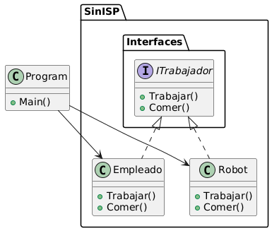
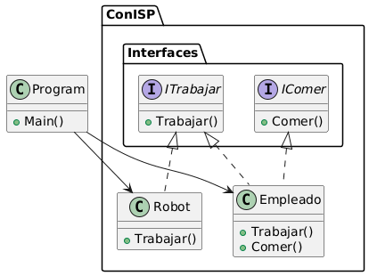

## Interface Segregation Principle

No se debe forzar a los clientes a depender de métodos que no utilizan osea intenta que tus interfaces sean lo suficientemente estrechas para que las clases del cliente no tengan que implementar comportamientos
que no necesitan

## Diagramas

### Sin ISP

### Con ISP

