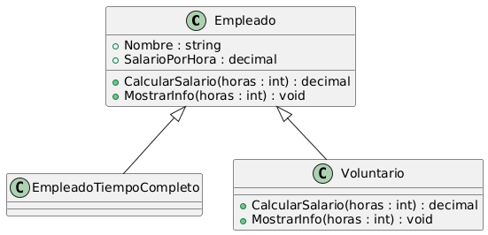
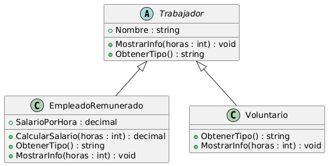

## Liskov Substitution Principle

Al extender una clase, recuerda que debes tener la capacidad de pasar objetos de las subclases en lugar de objetos
de la clase padre, sin descomponer el código cliente.

Esto implica que la subclase tiene que seguir siendo compatible con la conducta de la superclase. Cuando se sobrescribe un método, Amplía el comportamiento base en vez de reemplazarlo. con algo completamente diferente

## Diagramas

## Sin LSP

### Con LSP

