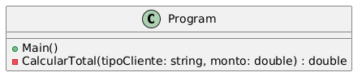
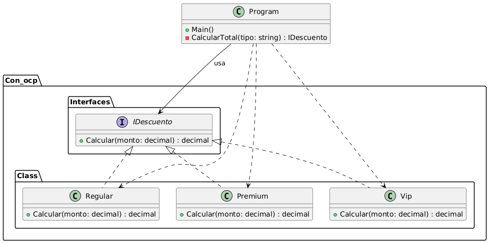

## Open/Closed principle

Las clases deben estar abiertas a la extensión pero cerradas a la modificación.

El objetivo principal de este principio es impedir que el código ya existente se descomponga si introduces nuevas funcionalidades

## Diagramas

## Sin OCP

### Con OCP

