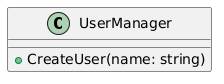
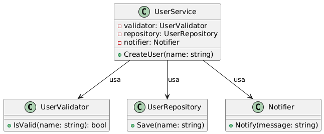

## Single Responsibility Principle

Este principio establece que una clase solo debe tener una responsabilidad. El principal objetivo de este principio es reducir la complejidad surgen cuando tu programa crece y cambia constantemente. En cierto punto, las clases se vuelven tan grandes que ya no puedes recordar sus detalles

## Diagrama

### Sin SRP

### Con SRP

